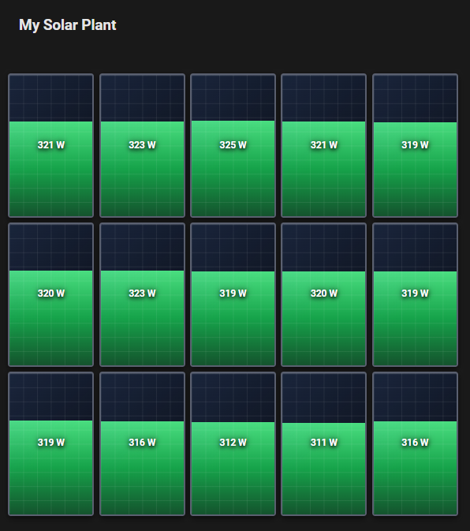

# Solar Panel Card



Custom Lovelace card for Home Assistant that displays a real-time solar panel array with per-panel power visualization.

Each panel in the grid shows a fill effect from bottom to top (dark background to bright green), proportional to its current output relative to the configured maximum power.

Clicking on any panel opens the **more-info** dialog for the entity associated with that panel.

---

## Features

- Visual editor for easy configuration (no YAML needed)
- Two operation modes: **string** (central inverter) and **microinverter** (per-panel sensors)
- Automatic unit detection (W or kW) from the entity's `unit_of_measurement`
- Realistic panel appearance with photovoltaic cell grid, anti-reflective coating effect, and aluminum frame
- Click any panel to open its entity details
- Smooth 0.4s fill animation on value updates
- Entity validation in the visual editor

---
## Support

If you find this card useful, you can support my work:

<a href="https://buymeacoffee.com/ffunes" target="_blank"></a>

---

## Installation

### Via HACS (recommended)

1. Open HACS → **Frontend** → three-dot menu → **Custom repositories**.
2. Add this repository URL with category **Lovelace**.
3. Search for "Solar Panel Card" and install it.
4. Reload your browser.

### Manual

1. Copy `dist/ha-solar-panel-card.js` to `<config>/www/ha-solar-panel-card.js`.
2. In Home Assistant go to **Settings → Dashboards → Resources** and add:
   - URL: `/local/ha-solar-panel-card.js`
   - Type: `JavaScript Module`
3. Reload your browser.

---

## Configuration

You can configure the card using the **visual editor** or manually via YAML.

```yaml
type: custom:ha-solar-panel-card
name: My Solar Installation        # Optional
rows: 3
columns: 5
panel_max_power: 400                # Peak watts per panel
mode: string                        # "string" or "microinverter"
entity: sensor.total_solar_power    # Only for mode: string
```

### Parameters

| Parameter | Type | Required | Description |
| :--- | :---: | :---: | :--- |
| `type` | `string` | Yes | Must be `custom:ha-solar-panel-card`. |
| `name` | `string` | — | Card title (displayed above the grid). |
| `rows` | `number` | Yes | Number of panel rows. |
| `columns` | `number` | Yes | Number of panel columns. |
| `panel_max_power` | `number` | Yes | Maximum power per panel in Watts (defines the 100% fill level). |
| `mode` | `string` | Yes | `string` (central inverter) or `microinverter` (one sensor per panel). |
| `entity` | `string` | `mode: string` | Entity reporting total installation power. |
| `entities` | `list` | `mode: microinverter` | Ordered list (left→right, top→bottom) of individual panel entities. Length must equal `rows × columns`. |

---

## Operation Modes

### `mode: string` — Central inverter

A single inverter reports total power output. The card divides the value equally across all panels.

```yaml
type: custom:ha-solar-panel-card
name: South Roof
rows: 2
columns: 6
panel_max_power: 400
mode: string
entity: sensor.inverter_ac_power
```

### `mode: microinverter` — Individual microinverters / MPPTs

Each panel has its own entity. The `entities` list must have exactly `rows × columns` entries, mapped left-to-right, top-to-bottom.

```yaml
type: custom:ha-solar-panel-card
name: East-West Installation
rows: 3
columns: 4
panel_max_power: 380
mode: microinverter
entities:
  - sensor.panel_1_1
  - sensor.panel_1_2
  - sensor.panel_1_3
  - sensor.panel_1_4
  - sensor.panel_2_1
  - sensor.panel_2_2
  - sensor.panel_2_3
  - sensor.panel_2_4
  - sensor.panel_3_1
  - sensor.panel_3_2
  - sensor.panel_3_3
  - sensor.panel_3_4
```

---

## Visual Behavior

- **Fill level**: The green bar grows from the bottom of each panel proportional to `(current_power / panel_max_power) × 100%`.
- **Animation**: Smooth `0.4s ease-out` transition when values update.
- **Labels**: Shows `W` for values below 1,000 W, or `kW` for values above (e.g., `1.25 kW`). Small values (< 10 W) display one decimal place.
- **Clamping**: The fill bar never exceeds 100% or drops below 0%, even if the sensor reports out-of-range values.
- **Unit auto-detection**: If an entity's `unit_of_measurement` is `kW`, the value is automatically converted to W internally.
- **Click interaction**: Clicking a panel opens the Home Assistant more-info dialog for that panel's entity.

---
